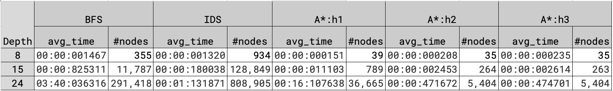
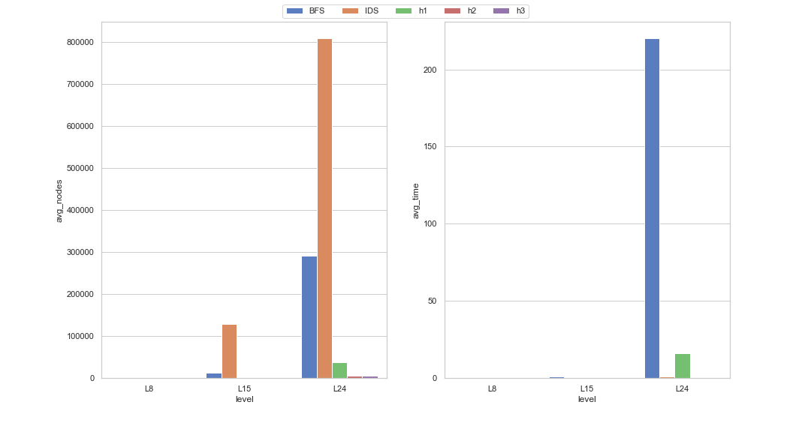
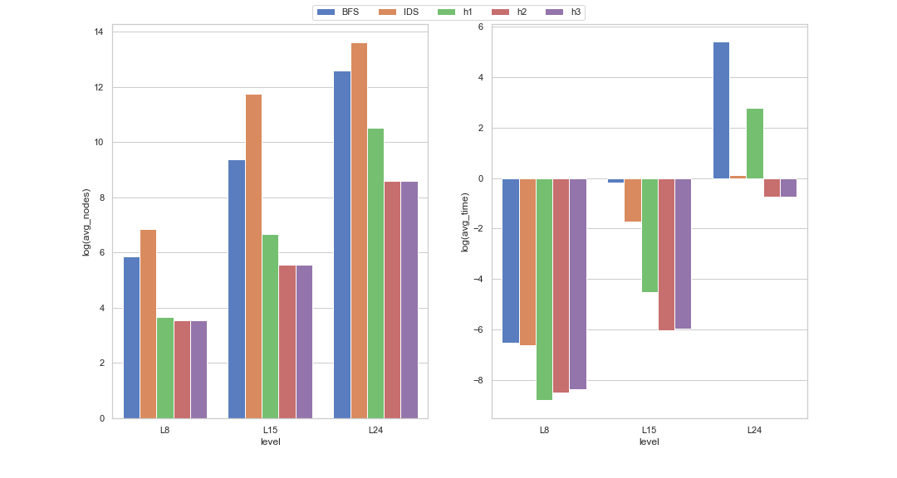

# 8 puzzle solver

- [8 puzzle solver](#8-puzzle-solver)
  - [File directory](#file-directory)
  - [Puzzle format](#puzzle-format)
  - [How to run](#how-to-run)
  - [Run Part 2](#run-part-2)
  - [Run Part 3](#run-part-3)
  - [Analysis of performance](#analysis-of-performance)
  - [Conclusions](#conclusions)

## File directory

```txt
📁 8-puzzle
┣━━ main.py - parse command line arguments and run the program
┣━━ search.py - implements search algorithms and classes
┣━━ utils.py - implements utility functions like reading input file, printing output, heuristics, etc.
┣━━ perf_analysis_p2 - performance analysis for p2
┗━━ perf_analysis_p3 - performance analysis for p3
```

The following algorithms are implemented in search

1. BFS (Breath First Search)
2. IDS (Iterative deepening DFS)
3. A\* with misplaced title heuristic. (h1)
4. A\* with Manhattan distance heuristic (h2).
5. A\* with max of misplaced tile and Manhattan distance heuristic (h3).

## Puzzle format

Sample input file : `easy.txt`

```txt
1 2 3
4 6 8
7 5 _
```

where `_` is the empty tile.

Goal state is

```txt
1 2 3
4 5 6
7 8 _
```

In code, puzzle is defined with tuples

```python
goal = (1, 2, 3, 4, 5, 6, 7, 8, 0)
```

where `0` is the empty tile.

## How to run

Input: Two command line arguments:

1. File path and
2. Algorithm to be used `(BFS/IDS/h1/h2/h3)`

Output:

1. Total nodes generated (for A\* this includes nodes in closed list and fringe).
2. Total time taken.
3. Path length
4. A valid sequence of actions which will take the given state to the goal state.

```bash
python main.py --fPath <PATH_TO_FILE> --alg <ALGORITHM_NAME>
```

example run

```bash
python main.py --fPath test/test_p2/easy.txt --alg h1
## expected output
# Total nodes generated: 12
# Total time taken:, 0 sec 64 microSec
# Path length: 4
# A valid sequence of actions: DRUL
```

## Run Part 2

This runs 5 states given in Part2 for all the 5 algorithms (i.e., in total
there’ll be 25 runs).

Run on sample

```bash
python perf_analysis_p2.py --in_dir test/test_p2 --out_dir test/test_out
```

expected output is in [test/test_out/part2.txt](test/test_out/part2.txt)

Run on part 2

```bash
python perf_analysis_p2.py --in_dir part2 --out_dir submit
```

output is in [submit/part2.txt](submit/part2.txt)

## Run Part 3

In this part, we compare the performance of the algorithms

1. In file part3 you’ll find 60 8-puzzles. 20 from each of 8, 15, and 24 levels, where level indicates the optimal path length of the state from the goal.
2. For states in each level solve the puzzle and calculate the average run time and average nodes generated for all the five algorithms.

Run on sample

```bash
python perf_analysis_p3.py --in_dir test/test_p3 --out_dir test/test_out
```

expected output is in [test/test_out/part3.txt](test/test_out/part3.txt)

where the values are tuples, and index 0 is the average nodes generated and index 1 is the average time taken in the format `mm:ss:msmsms`

Run on part 3

```bash
python perf_analysis_p3.py --in_dir part3 --out_dir submit
```

output is in [submit/part3.txt](submit/part3.txt)

## Analysis of performance







## Conclusions

On L8, we can observe that IDS generates 3 times more nodes but has a similar average runtime compared to BFS. However, heuristic search algorithms (h1, h2, h3) are ~10x faster and generates 10x fewer nodes on average compared to BFS and IDS. On this level, h1 is faster than h2 and h3, but as the level increases, h2 and h3 is similar in performance (both runtime and \#nodes) and is much faster than h1. BFS and IDS also increases exponentially as levels increase, where BFS is slower than IDS but generates fewer nodes on average, and IDS is faster but generates far more on average. Overall the best algorithm is h2, which is the Manhattan distance heuristic, but h3 follows closely behind.
